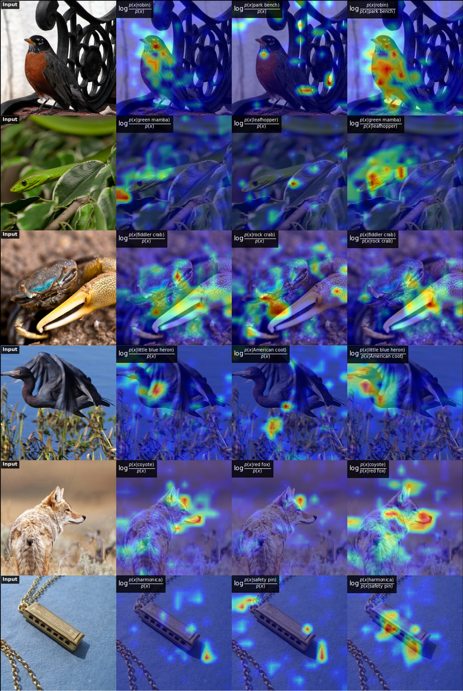
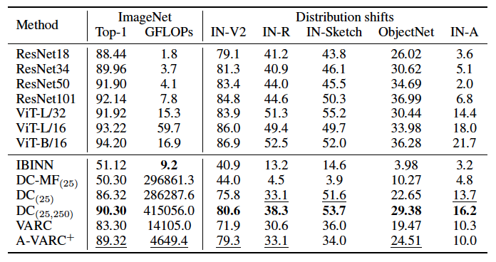
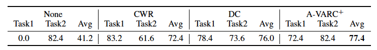

# A-VARC
[ICLR 2026] Your VAR Model is Secretly an Efficient and Explainable Generative Classifier



<a href="https://openreview.net/pdf?id=zFF0WRMjlp"></a>

> **Your VAR Model is Secretly an Efficient and Explainable Generative Classifier**
> <br>
> [Yi-Chung Chen<sup>1</sup>](https://yi-chung-chen.github.io),
> [David I. Inouye<sup>1</sup>](https://www.davidinouye.com/),
> [Jing Gao<sup>1</sup>](https://engineering.purdue.edu/~jinggao/)
> <br>
> <sup>1</sup> Elmore Family School of Electrical and Computer Engineering, Purdue University

## Overview

**Can a generative model classify images — efficiently?**

We show that Visual Autoregressive (VAR) models make surprisingly strong generative classifiers. Thanks to tractable likelihoods, they are far faster than diffusion-based counterparts at inference time. We further introduce **A-VARC+**, which boosts accuracy while cutting cost. Beyond raw performance, VAR-based classifiers unlock two practical benefits out of the box:

- **Explainability** — token-wise mutual information provides fine-grained visual explanations of predictions
- **Class-incremental learning** — new classes can be added without any replay data

## Installation

### 1. Clone the repository

```bash
git clone --recurse-submodules https://github.com/Yi-Chung-Chen/A-VARC.git
cd A-VARC
```

If you already cloned without `--recurse-submodules`, initialize the VAR submodule manually:

```bash
git submodule update --init --recursive
```

### 2. Set up the environment

**Option A — conda (recommended, fully reproducible):**

```bash
conda env create -f environment.yml
conda activate a-varc
```

**Option B — pip only:**

```bash
pip install torch torchvision --index-url https://download.pytorch.org/whl/cu126
pip install -r requirements.txt
```

> Adjust the CUDA version (`cu126`) to match your system. See [PyTorch Get Started](https://pytorch.org/get-started/locally/) for other options.

### 3. Model weights

VAR model checkpoints and the VQ-VAE weights (`vae_ch160v4096z32.pth`) are **automatically downloaded** from HuggingFace on first run. You can also place pre-downloaded checkpoints under `./weights/`:

```
weights/
  imagenet/
    var_d16.pth
    var_d20.pth
    ...
```

### 4. Dataset setup

Place the ImageNet validation set under `./datasets/`:

```
datasets/imagenet/
  val/
    n01440764/
      ILSVRC2012_val_00000293.JPEG ...
```

Other supported datasets (ImageNetV2, ObjectNet) follow the same `./datasets/<dataset>/` convention.

## Quick Start

Run classification on ImageNet validation set:

```bash
python eval.py \
  --dataset imagenet \
  --depth 16 \
  --batch_size 1 \
  --model_ckpt ./weights/imagenet/var_d16.pth \
  --num_candidate_list "10,3,1" \
  --num_sample_list "1,1,3" \
  --num_scale_list "6,10,10" \
  --synset_subset_path subsets/imagenet100.txt
```

## Comparative Analysis



## Class-Incremental Learning



## Citation

```bibtex
@article{chen2025your,
  title={Your VAR Model is Secretly an Efficient and Explainable Generative Classifier},
  author={Chen, Yi-Chung and Inouye, David I and Gao, Jing},
  journal={arXiv preprint arXiv:2510.12060},
  year={2025}
}
```

## Acknowledgements

This project builds on the [VAR](https://github.com/FoundationVision/VAR) codebase.

## License

See [LICENSE](LICENSE) for details.
